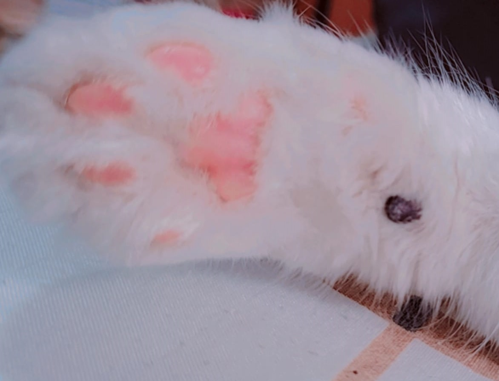

   

## 🖥️ Pojeto

Esse é um projeto responsivo de uma cápsula do tempo para exibir memórias em uma linha do tempo.

## 🚀 Tecnologias

Esse projeto foi desenvolvido durante o NLW da Rocktseat com as seguintes tecnologias:

.HTML
.CSS
.Git e Github

Você pode visulizar o video através
[desselink](<https://www.tiktok.com/@tibby1993/video/7190576742824709382?_r=1&_t=8dVKGWy7cOM&social_sharing=v5)
É necessario ter uma conta no [Tiktok](https://www.tiktok.com)